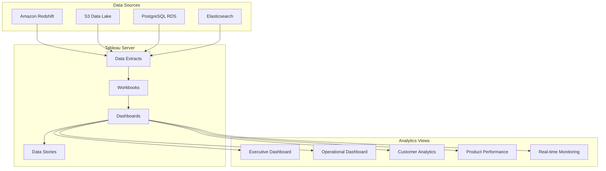

# E-ComPulse Tableau Analytics

## 📊 Overview

This directory contains Tableau dashboards, workbooks, and configuration files for business intelligence and advanced analytics visualization for the E-ComPulse Insights Platform.

## 🏗️ Dashboard Architecture



## 📁 Directory Structure

```
tableau/
├── README.md                           # This file
├── workbooks/                          # Tableau workbook files (.twbx)
│   ├── executive-dashboard.twbx        # Executive summary dashboard
│   ├── operational-dashboard.twbx      # Operational metrics dashboard
│   ├── customer-analytics.twbx         # Customer behavior analysis
│   ├── product-performance.twbx        # Product performance metrics
│   └── real-time-monitoring.twbx       # Real-time operational monitoring
├── data-sources/                       # Data source connections
│   ├── redshift-connection.tds         # Redshift data source
│   ├── s3-connection.tds               # S3 data lake connection
│   └── elasticsearch-connection.tds    # Elasticsearch connection
├── extracts/                           # Data extract definitions
│   ├── customer-data.hyper            # Customer dimension extract
│   ├── product-data.hyper              # Product dimension extract
│   └── sales-data.hyper                # Sales fact extract
├── server-config/                      # Tableau Server configuration
│   ├── server-settings.json           # Server configuration
│   ├── permissions.json               # User permissions
│   └── schedules.json                  # Refresh schedules
├── style-guide/                        # Design and style guidelines
│   ├── color-palette.tps              # Color palette
│   ├── formatting-template.twb        # Formatting template
│   └── design-guidelines.md           # Design guidelines
└── deployment/                         # Deployment scripts
    ├── deploy-workbooks.py            # Workbook deployment script
    ├── setup-data-sources.py          # Data source setup
    └── configure-server.py             # Server configuration
```

## 🚀 Quick Start

### 1. Setup Data Connections

```bash
# Configure data sources
python deployment/setup-data-sources.py --config production

# Test connections
python deployment/test-connections.py
```

### 2. Deploy Workbooks

```bash
# Deploy all workbooks to Tableau Server
python deployment/deploy-workbooks.py --environment production

# Deploy specific workbook
python deployment/deploy-workbooks.py --workbook executive-dashboard --environment production
```

### 3. Configure Permissions

```bash
# Setup user permissions
python deployment/configure-server.py --permissions server-config/permissions.json
```

## 📈 Dashboard Specifications

### 1. Executive Dashboard

**Purpose**: High-level business metrics for C-level executives
**Refresh**: Every 15 minutes
**Data Sources**: Redshift (aggregated data)

**Key Metrics**:
- Total Revenue (Current vs Previous Period)
- Conversion Rate Trends
- Customer Acquisition Cost (CAC)
- Lifetime Value (LTV)
- Market Share Analysis
- Geographic Performance

**Views**:
- Revenue Dashboard
- KPI Scorecard
- Geographic Heat Map
- Trend Analysis
- Executive Summary

### 2. Operational Dashboard

**Purpose**: Real-time operational metrics for operations teams
**Refresh**: Every 5 minutes
**Data Sources**: Elasticsearch, Redshift

**Key Metrics**:
- System Performance (Latency, Throughput)
- Error Rates and Alerts
- Data Processing Status
- Infrastructure Health
- Cost Analysis

**Views**:
- System Health Overview
- Performance Metrics
- Alert Management
- Cost Analysis
- Capacity Planning

### 3. Customer Analytics

**Purpose**: Deep customer behavior and segmentation analysis
**Refresh**: Hourly
**Data Sources**: Redshift, S3 Data Lake

**Key Metrics**:
- Customer Segmentation
- Purchase Behavior Analysis
- Customer Journey Mapping
- Retention Analysis
- Churn Prediction

**Views**:
- Customer Segmentation
- Behavior Analysis
- Journey Mapping
- Retention Dashboard
- Churn Analysis

### 4. Product Performance

**Purpose**: Product-specific performance and analysis
**Refresh**: Every 30 minutes
**Data Sources**: Redshift, Elasticsearch

**Key Metrics**:
- Product Sales Performance
- Inventory Analysis
- Category Performance
- Price Optimization
- Recommendation Engine Performance

**Views**:
- Product Performance
- Category Analysis
- Inventory Dashboard
- Price Analysis
- Recommendation Metrics

### 5. Real-time Monitoring

**Purpose**: Live monitoring of platform operations
**Refresh**: Every 1 minute
**Data Sources**: Elasticsearch, Live API feeds

**Key Metrics**:
- Live Event Stream
- Active Users
- Current Sales
- System Alerts
- Performance Monitoring

**Views**:
- Live Event Dashboard
- Active Users Monitor
- Sales Ticker
- Alert Console
- Performance Monitor

## 🎨 Design Guidelines

### Color Palette

**Primary Colors**:
- Primary Blue: #2E86C1
- Secondary Blue: #5DADE2
- Accent Green: #58D68D
- Warning Orange: #F39C12
- Error Red: #E74C3C

**Supporting Colors**:
- Light Gray: #F8F9FA
- Medium Gray: #6C757D
- Dark Gray: #343A40
- White: #FFFFFF

### Typography

**Headers**: Tableau Bold, 16-24pt
**Body Text**: Tableau Book, 10-12pt
**Metrics**: Tableau Medium, 14-18pt

### Layout Principles

1. **Consistency**: Uniform spacing, colors, and fonts
2. **Hierarchy**: Clear visual hierarchy with headers and sections
3. **Accessibility**: High contrast ratios, readable fonts
4. **Mobile**: Responsive design for tablet viewing
5. **Performance**: Optimized for fast loading

## 📊 Data Source Configuration

### Amazon Redshift Connection

```json
{
  "connection_type": "amazon-redshift",
  "server": "ecompulse-redshift.cluster-xyz.us-west-2.redshift.amazonaws.com",
  "port": 5439,
  "database": "ecompulse_analytics",
  "warehouse": "ANALYTICS_WH",
  "authentication": "iam",
  "ssl_mode": "require",
  "connection_pool": {
    "initial_sql": "SET search_path TO analytics, public;",
    "connection_limit": 10
  }
}
```

### S3 Data Lake Connection

```json
{
  "connection_type": "amazon-s3",
  "bucket": "ecompulse-datalake",
  "region": "us-west-2",
  "access_method": "iam_role",
  "file_format": "parquet",
  "compression": "snappy",
  "partition_scheme": "year/month/day/hour"
}
```

### Elasticsearch Connection

```json
{
  "connection_type": "elasticsearch",
  "endpoints": [
    "https://search-ecompulse-xyz.us-west-2.es.amazonaws.com"
  ],
  "authentication": "aws_iam",
  "index_pattern": "ecompulse-events-*",
  "time_field": "@timestamp"
}
```

## 🔄 Automated Refresh Schedules

### Data Extract Refresh

```json
{
  "schedules": [
    {
      "name": "Executive Dashboard Refresh",
      "frequency": "15_minutes",
      "workbooks": ["executive-dashboard"],
      "priority": "high"
    },
    {
      "name": "Operational Dashboard Refresh", 
      "frequency": "5_minutes",
      "workbooks": ["operational-dashboard", "real-time-monitoring"],
      "priority": "high"
    },
    {
      "name": "Analytics Dashboard Refresh",
      "frequency": "1_hour",
      "workbooks": ["customer-analytics", "product-performance"],
      "priority": "normal"
    }
  ]
}
```

### Extract Optimization

```json
{
  "extract_settings": {
    "incremental_refresh": true,
    "refresh_type": "append",
    "filter_conditions": [
      "event_date >= DATEADD('day', -7, TODAY())"
    ],
    "aggregation_level": "hourly",
    "compression": "high"
  }
}
```

## 🔒 Security & Permissions

### User Roles

**Executive Users**:
- View: Executive Dashboard, High-level Analytics
- Permissions: Read-only access to all dashboards
- Data: Aggregated data only

**Operations Users**:
- View: Operational Dashboard, Real-time Monitoring
- Permissions: Read-only with alert management
- Data: System metrics and operational data

**Analytics Users**:
- View: All dashboards with deep-dive capabilities
- Permissions: Read access, export capabilities
- Data: Detailed transactional data

**Admin Users**:
- View: All dashboards and server management
- Permissions: Full access including configuration
- Data: All data including sensitive information

### Row-Level Security

```sql
-- Customer data access based on user region
CASE 
  WHEN [User Region] = 'US' THEN [Customer Region] IN ('US', 'CA')
  WHEN [User Region] = 'EU' THEN [Customer Region] IN ('EU', 'UK')
  ELSE FALSE
END
```

## 📱 Mobile Optimization

### Responsive Design

- **Tablet Layout**: Optimized for 10-12 inch tablets
- **Phone Layout**: Key metrics only for mobile phones
- **Touch Interactions**: Large buttons and touch-friendly navigation
- **Offline Capability**: Cached data for offline viewing

### Mobile-Specific Dashboards

1. **Mobile Executive Summary**
2. **Mobile Operations Monitor**
3. **Mobile Sales Tracker**

## 🚨 Monitoring & Alerts

### Performance Monitoring

```json
{
  "performance_alerts": [
    {
      "metric": "dashboard_load_time",
      "threshold": "10_seconds",
      "action": "alert_admin"
    },
    {
      "metric": "extract_refresh_failure",
      "threshold": "1_failure",
      "action": "alert_admin_and_users"
    },
    {
      "metric": "concurrent_users",
      "threshold": "100_users",
      "action": "scale_server"
    }
  ]
}
```

### Business Alerts

- Revenue drops below threshold
- Conversion rate anomalies
- System performance degradation
- Data freshness issues

## 🔧 Troubleshooting

### Common Issues

1. **Slow Dashboard Loading**
   - Check extract size and optimization
   - Review calculation complexity
   - Verify server resources

2. **Data Refresh Failures**
   - Validate data source connections
   - Check authentication credentials
   - Review error logs

3. **Permission Issues**
   - Verify user group memberships
   - Check project permissions
   - Review row-level security

### Performance Optimization

1. **Extract Optimization**
   - Use filtered extracts
   - Aggregate data at appropriate level
   - Remove unnecessary fields

2. **Calculation Optimization**
   - Use table calculations instead of row-level calculations
   - Leverage database calculations
   - Minimize complex nested calculations

3. **Dashboard Optimization**
   - Limit number of charts per dashboard
   - Use dashboard actions for interactivity
   - Optimize image sizes

## 📞 Support

For Tableau support and questions:
- 📧 **Email**: tableau-support@ecompulse.com
- 📚 **Documentation**: https://docs.ecompulse.com/tableau
- 🎓 **Training**: https://training.ecompulse.com/tableau
